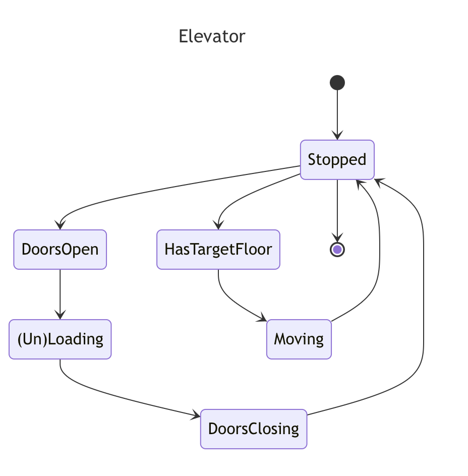

# Elevator

## Goal: Simulate how long it will take an elevator to clear people from a given starting state

Currently, the starting state is defined by the fluent configuration in [Application.java](src/main/java/jgoeglein/bluestaq/elevator/Application.java):

```java
Elevator elevator = new Elevator()
    .floors(10)
    .maxPassengers(8)
    .currentFloor(1)
    .waiting(new HashMap<>(Map.of(5, 2, 8, 1)))
    .passengers(new HashMap<>())
    .speedPerFloorS(10)
    .doorOpenCloseSpeedS(4)
    .personOnOffSpeedS(10);
```

## Running

```shell
./gradlew test
./gradlew run
```

```shell
==== Starting Elevator State ====
Floor 10:
Floor 9:
Floor 8:     x
Floor 7:
Floor 6:
Floor 5:     xx
Floor 4:
Floor 3:
Floor 2:
Floor 1: [E]

Initial: Floor 1, Waiting: {8=1, 5=2}
At floor 8, Passengers: 0
At floor 5, Passengers: 1
At floor 1, Passengers: 3

==== Ending Elevator State ====
Floor 10:
Floor 9:
Floor 8:
Floor 7:
Floor 6:
Floor 5:
Floor 4:
Floor 3:
Floor 2:
Floor 1: [E]

All passengers cleared in 228 seconds
```

## Assumptions

1. Modeling a single elevator, not a bank
1. All floors are always accessible (no auth)
1. Elevator must finish (un)loading passengers before changing direction
1. No labeling of floors (B1, Penthouse, etc)
1. Passengers are only going from first floor to floor X (or vice versa)
1. Speed-per-floor is an average. Real world would be different due to acceleration/deceleration
1. Doesn't handle changes to people coming and going while the elevator is operating
1. Passengers boarding on the first floor are randomly assigned destination floors above

## State Diagram

```
---
title: Elevator
---
stateDiagram-v2
---
title: Elevator
---
stateDiagram-v2
    [*] --> Stopped
    Stopped --> DoorsOpen
    DoorsOpen --> (Un)Loading
    (Un)Loading --> DoorsClosing
    DoorsClosing --> Stopped
    Stopped --> HasTargetFloor
    HasTargetFloor --> Moving
    Moving --> Stopped
    Stopped --> [*]
```



## Things I'd like to improve

1. The fluent interface works, but it would be better if you could feed it configuration files and get an output (or outputs).
1. Support for adding new "waiters" during runtime to see how that can affect things.
1. Support for a bank of elevators to see how much that improves my made up "time to clear".
1. Clearer and more complete logging for debug purposes
1. More testing. I was surprised at how many different ways I made mistakes along the way.

## Instructions

The Elevator

Provide code that simulates an elevator. You may use any language (recommend using java or Python).
Please upload your code Git Hub for a discussion during your interview with our team.
Additionally, document all assumptions and any features that weren't implemented.
Please be prepared to discuss the assumptions and features that were not implemented during your interview!
